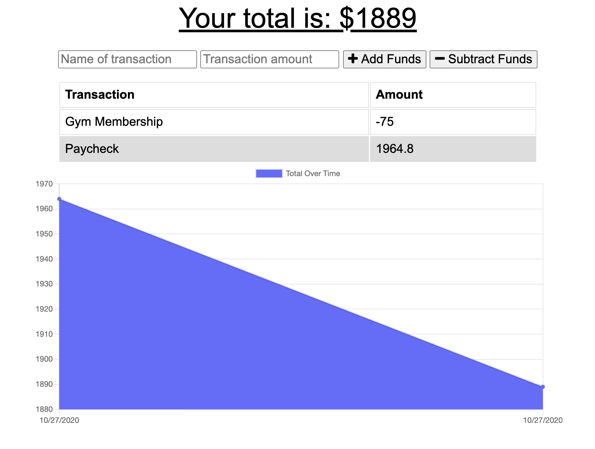

# Budget Tracker · 

  ## Description

  Budget Tracker is an app that allows users to quickly input and track their deposits and expenses, even offline. When entering transactions offline, transactions will be cached and the transaction API will be called with the cached data once an internet connection is re-established, updating the transaction total and database.

  
  
  ## Table of Contents
  
  * [Installation](#installation)
  * [Usage](#usage)
  * [Contributing](#contributing)
  * [License](#license)
  * [Questions](#questions)
  
  
  ## Installation
  
If you'd like to run this application locally, you will need to install the required dependencies using `npm install` and connect to your local MongoDB.
  
  ## Usage 
  
You can view the deployed application [here](https://budget-tracker-dp.herokuapp.com).
  
  ## Contributing
    
  Open to any and all contributions. Please ensure your pull requests adhere to the following guidelines:
  - Keep descriptions short and simple, but descriptive
  - Check your spelling and grammar

  ## License
  
  Budget Tracker is [MIT licensed](https://opensource.org/licenses/MIT).

  ## Questions
  
  If you have additional questions, you can reach me at: dpan5425@gmail.com
